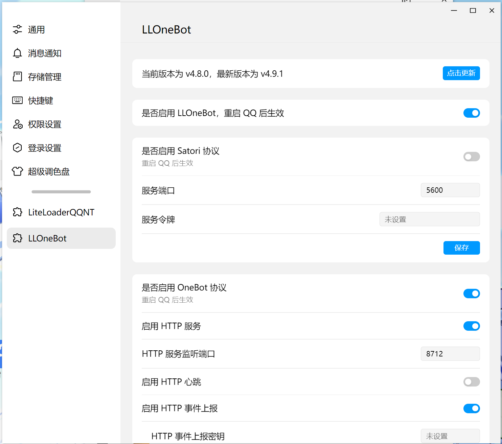
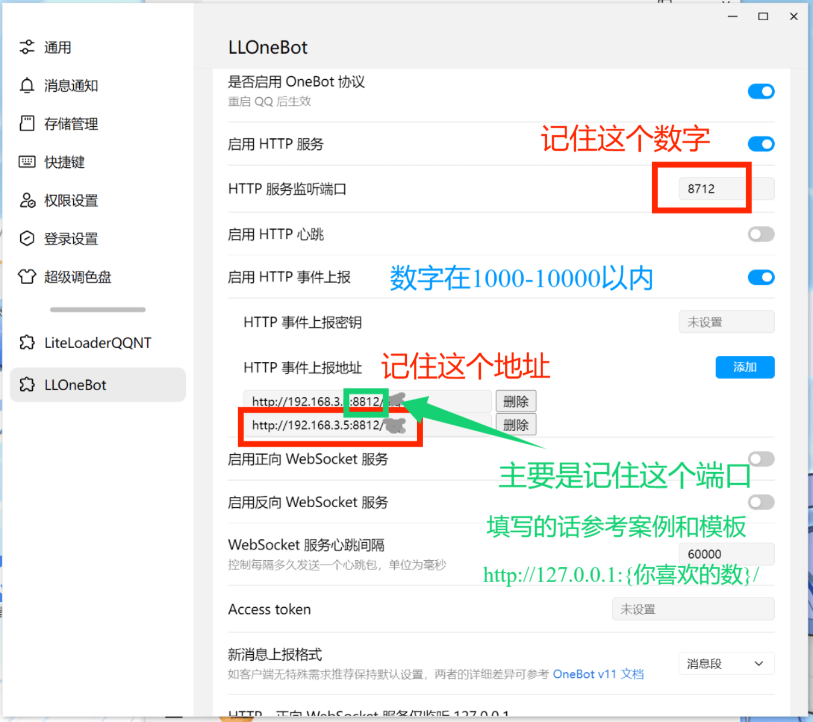
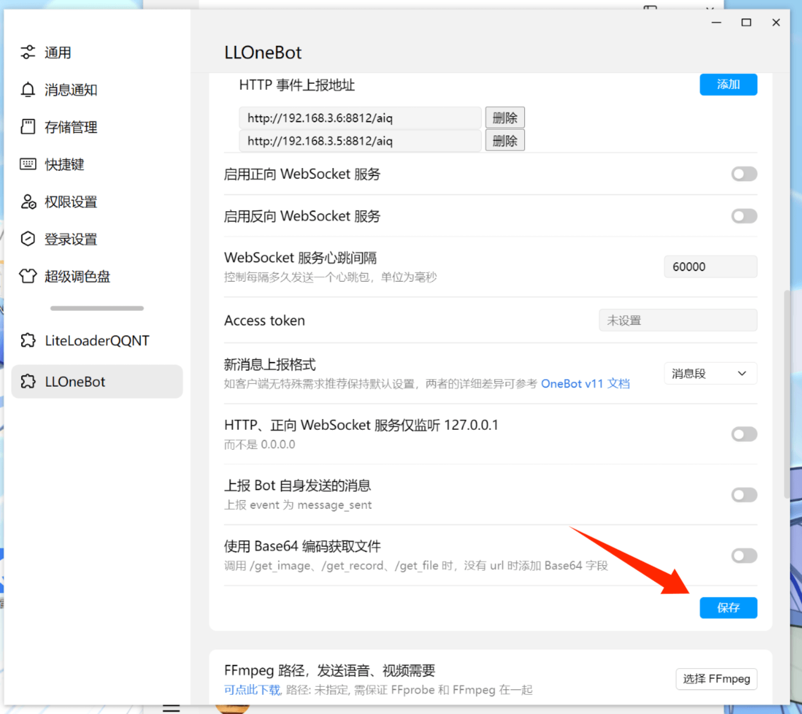
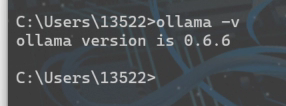

# AIE
## 一个智能化机器人
#### 有时候可能不智能（
#
# 食用方法
首先得确保你的qq已安装好 **llonebot**

安装教程看：

https://llonebot.com/zh-CN/

安装好后是这个样子：

随后填写好端口（后面注册会用到）

然后保存

# （可选）配置ollama

安装ollama：

~~~
ollama可用于在api无法访问时，进行本地部署辅助生成
警告：低配置显卡建议不要使用本地部署
不然你的电脑会爆炸
以使用的14b为例子
推荐 32G以上内存 和 14G以上显存的nv卡
当然配置不达标也可以跑，只是很！慢！
（作者是用7945HX+32G内存 cpu硬推理的）
~~~

https://ollama.com/

安装好后打开cmd（打开方法自行百度），输入“ollama -v”

若显示这样就表示安装成功！

**如果安装不成功的话是这样子**

### 至此，ollama安装完毕